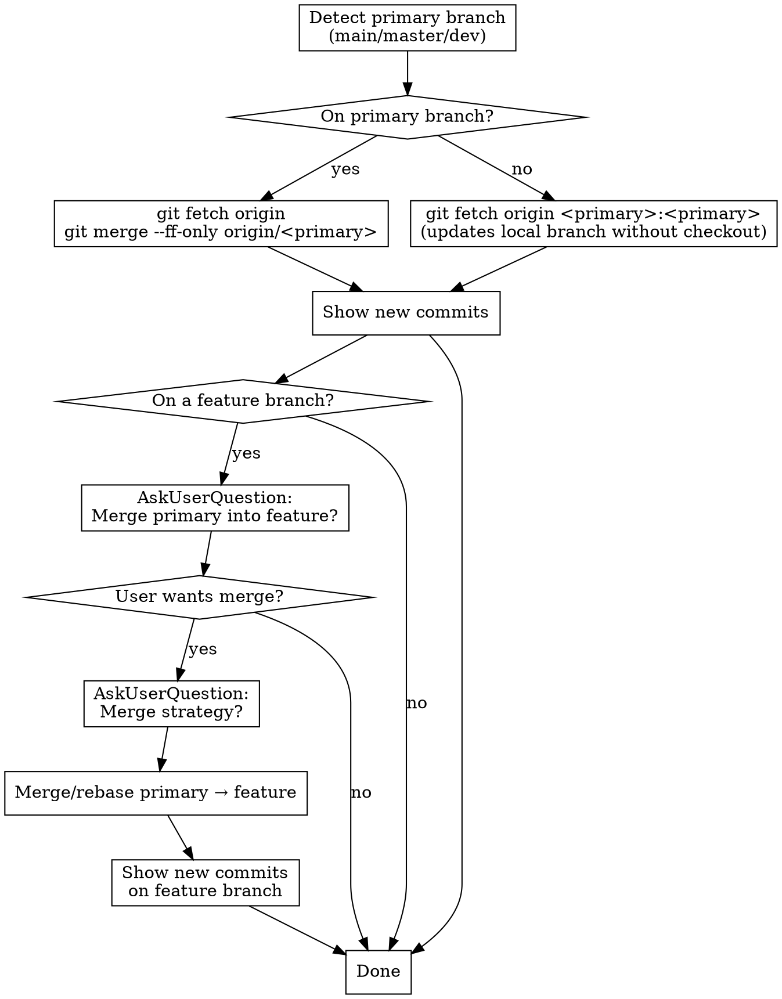

# Sync Latest Git

Update the primary branch from origin and optionally merge/rebase into the current feature branch.

## Workflow



### Step-by-step

1. **Detect primary branch**: Check which of `main`, `master`, or `dev` exists as a local branch tracking a remote. Prefer `main` > `master` > `dev`.

2. **Record starting point**:
   ```bash
   OLD_HEAD=$(git rev-parse <primary>)
   ```

3. **Update the primary branch**:

   **If on the primary branch:**
   ```bash
   git fetch origin
   git merge --ff-only origin/<primary>
   ```

   **If on a feature branch** (do NOT checkout primary):
   ```bash
   git fetch origin <primary>:<primary>
   ```
   This fast-forward updates the local primary branch without switching branches. If it outputs `! [rejected]`, the local branch has diverged — STOP and tell the user.

4. **Show new commits** (subject, author, and date):
   ```bash
   git log --format="%h %s (%an, %ar)" <OLD_HEAD>..<primary>
   ```
   If no output, say "Already up to date."

5. **If on a feature branch**: Ask the user via AskUserQuestion:

   **Question 1**: "Merge `<primary>` into `<feature-branch>`?"
   - Options: Yes (Recommended), No

   **Question 2** (only if yes): "Merge strategy?"
   - Options:
     - Merge commit (Recommended) — `git merge <primary>`
     - Rebase — `git rebase <primary>` (rewrites feature branch history)
     - Fast-forward only — `git merge --ff-only <primary>` (fails if feature has its own commits)

6. **Check for dirty working tree** before merging: if `git status --porcelain` has output, warn the user and suggest stashing or committing first.

7. **Perform the merge/rebase** using the chosen strategy. Record feature HEAD first:
   ```bash
   FEATURE_OLD_HEAD=$(git rev-parse HEAD)
   ```
   If merge conflicts occur, run `git merge --abort` (or `git rebase --abort`), tell the user which files conflicted, and suggest manual resolution.

8. **Show new commits** on the feature branch:
   ```bash
   git log --format="%h %s (%an, %ar)" <FEATURE_OLD_HEAD>..HEAD
   ```

9. **If rebase was used** and the feature branch has a remote tracking branch, force-push to update it:
   ```bash
   git push --force-with-lease
   ```
   Rebase rewrites history, so a force push is required. Use `--force-with-lease` (not `--force`) to avoid overwriting someone else's work.

### Edge cases

- **FF merge fails on primary**: Local primary has diverged from origin. Tell the user and suggest `git pull --rebase` or manual resolution. Do NOT force-push or reset.
- **Dirty working tree**: `fetch <primary>:<primary>` works regardless of working tree state, but merging/rebasing into the feature branch requires clean state. Check before step 7.
- **No remote tracking**: If the primary branch doesn't track a remote, tell the user.
